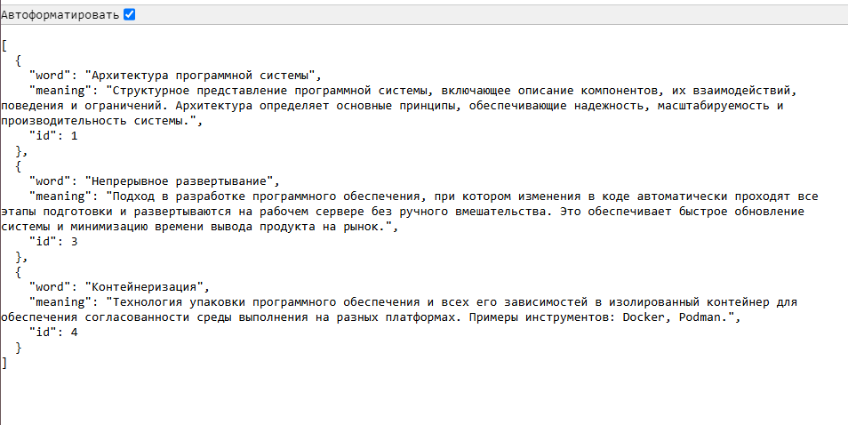

# docker-practice-7

Репозиторий для задания 7 курса "Проектирование и развертывание веб-решений в экосистеме Python". Магистерская программа Веб-технологии, Университет ИТМО, 2024

В задании нужно при помощи фреймворка FastAPI реализовать API для работы с глоссарием терминов для научной работы. Глоссарий должен поддерживать следующие операции:

- получение списка всех терминов,
- получение информации об одном термине,
- добавление нового термина,
- обновление существующего термина,
- удаление термина из глоссария.

## Инструкция для запуска приложения

### 1. Локальный запуск приложения

Если приложение требуется запустить _локально_, то нужно склонировать репозиторий при помощи команды:

```bash
git clone https://github.com/strawberrycheeks/docker-practice-7.git
```

Затем нужно перейти в созданную директорию при помощи команды:

```bash
cd docker-practice-7
```

Чтобы установить зависимости, нужно выполнить команду:

```bash
pip install -r requirements.txt
```

После успешной установки зависимостей приложение можно запустить, используя команду:

```bash
uvicorn app:app --reload
```

Список всех терминов будет доступен в формате JSON по адресу: [http://localhost:8000/terms](http://localhost:8000/terms).



Документация API будет доступна по адресу: [http://localhost:8000/docs](http://localhost:8000/docs).


### 2. Запуск приложения в виде Docker-контейнера

Если приложение требуется запустить в виде Docker-контейнера, то сначала нужно также склонировать репозиторий при помощи команды:

```bash
git clone https://github.com/strawberrycheeks/docker-practice-7.git
```

Затем нужно перейти в созданную директорию при помощи команды:

```bash
cd docker-practice-7
```

После этого собрать образ и запустить контейнер в Docker можно с помощью команды:

```bash
docker-compose up --build
```

Список всех терминов будет доступен в формате JSON по адресу: [http://localhost:8000/terms](http://localhost:8000/terms).
Документация API будет доступна по адресу: [http://localhost:8000/docs](http://localhost:8000/docs).

## Шаги выполнения задания

Для реализации были использованы:

- [FastAPI](https://fastapi.tiangolo.com/) — фреймворк для создания API на языке Python,

- [SQLModel](https://sqlmodel.tiangolo.com/) — библиотека для взаимодействия с SQL и реляционными базами данных при помощи объектов в Python,

- [SQLite](https://www.sqlite.org/index.html) — легковесная база данных, используемая для хранения терминов,

- [Uvicorn](https://www.uvicorn.org/) — ASGI-сервер для запуска приложения.
